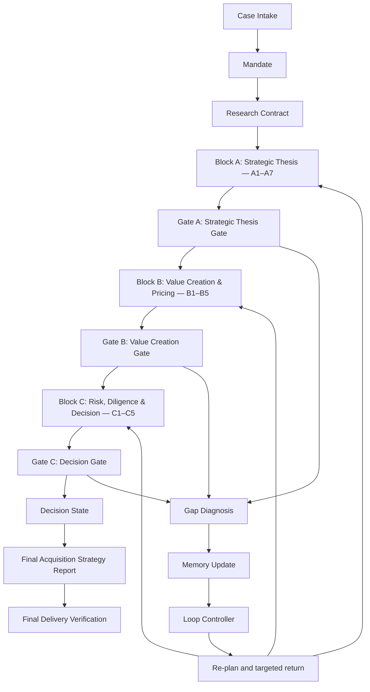

# Certified Deep Research Agents for AI-Native DealTech

DealTech explores transaction research systems that preserve an auditable research trail instead of producing an unsupported one-step report. The repository includes several research prototypes and a new, independently packaged **Buyer-side Acquisition Loop Agent**.

## Current implementation status

Buyer-side Acquisition Loop Agent `v0.1.0-rc1` is locally runnable. It supports case validation, the complete recorded A/B/C workflow, targeted gap loops, calculation replay, PCE and ER/BRB controls, Human Review, manifest-based resume, reporting and final delivery verification. `openai_live` provider code is implemented, but no paid live end-to-end validation has been performed and the Agent is not presented as production-ready.

The older Acquisition Strategy Agent remains a protected V0 reference. It is not the runtime foundation of the new agent. The public RC1 demo is fictional and does not use any legacy demonstration or confidential teacher case.

## Buyer-side acquisition workflow



Block A covers Transaction Context, Buyer Strategic Need, Strategic Rationale, Target Attractiveness, Target Capability & Business Quality, Industry / Competitive Position and Strategic Fit. Block B covers Standalone Financial Analysis, Synergy Mechanism & Value Creation, Valuation & Purchase Price Discipline, Deal Structure & Financing Impact and Returns Analysis. Block C covers Due Diligence, Regulatory Risk, Integration Risk, Downside Risk and Decision State.

## Gate, loop and certification separation

Provider research proposes Source, Evidence, Claim and domain records. Admission rejects malformed, unsupported or duplicate material. Required calculations preserve inputs, units, periods, perimeters, formulas and assumptions; an independent replay must pass before Gate B and Block C.

PCE applies claim-level delivery policy: a generated Claim may be Certified, Certified with Caveat, sent to Human Review, blocked or retained as internal trace. ER/BRB records evidence-row reliability and business/regulatory/reputational risk signals. PCE and ER/BRB do **not** decide Strategic Fit, valuation, purchase price, returns or transaction approval. The deterministic business Gates do that within their limited scope.

A Gate failure creates a typed Gap, updates append-only memory, selects only the affected module and dependencies, and re-evaluates the relevant Gate. Final delivery verification is separate again: it checks report sections, hashes, lineage, caveats, calculation replay and Human Review boundaries.

## Quick start

Python 3.11 or newer is required.

```bash
python -m venv .venv
python -m pip install -e ".[test]"
buyer-side-acquisition-loop --case agents/agents/buyer-side-acquisition-loop-agent/06_examples/recorded_full_pipeline_case/case.yaml --check-case
buyer-side-acquisition-loop --case agents/agents/buyer-side-acquisition-loop-agent/06_examples/recorded_full_pipeline_case/case.yaml --module FULL_PIPELINE
```

The equivalent module command is `python -m buyer_side_acquisition_loop_agent`. Resume an interrupted run with:

```bash
buyer-side-acquisition-loop --resume-run agents/agents/buyer-side-acquisition-loop-agent/06_examples/recorded_full_pipeline_case/run_output
```

Initialize a supported Human Review case, then apply its structured response once to the paused workspace:

```bash
buyer-side-acquisition-loop --case agents/agents/buyer-side-acquisition-loop-agent/06_examples/synthetic_human_only_information_case/case.yaml
buyer-side-acquisition-loop --case agents/agents/buyer-side-acquisition-loop-agent/06_examples/synthetic_human_only_information_case/case.yaml --human-review-response agents/agents/buyer-side-acquisition-loop-agent/06_examples/synthetic_human_only_information_case/valid_human_review_response.json
```

Human Review history is append-only, so a previously accepted `response_id` cannot be applied again.

Run deterministic release checks with:

```bash
python scripts/verify_buyer_side_agent_release.py
```

See [Quick start](agents/agents/buyer-side-acquisition-loop-agent/QUICKSTART.md) and the [case input guide](agents/agents/buyer-side-acquisition-loop-agent/CASE_INPUT_GUIDE.md).

## Recorded demo result

The continuous public fixture genuinely executes A1–A7, Gate A, B1–B5, all required calculations and replay, Gate B, C1–C5, Gate C, Decision State, the report and delivery verification under one case/run ID. Its criteria-derived result is:

| Control | Result |
|---|---|
| Gate A | `CONDITIONAL_PASS` |
| Gate B | `RENEGOTIATE_PRICE` |
| Gate C | `RENEGOTIATE` |
| Decision State | `RENEGOTIATE` |
| Delivery | `DELIVERABLE_WITH_CAVEATS` |

The demo includes targeted A6 source-diversity repair, B3/B5 calculation repair and C2/C4/C5 regulatory/downside/decision repair. These results are evaluated by the implemented criteria, not hard-coded by the full-pipeline orchestrator. A sanitized subset is in `recorded_full_pipeline_case/sample_output/`.

## Provider modes and attachments

`recorded` mode is deterministic and makes no network request. `openai_live` is never selected implicitly: it requires the optional dependency, configured model and credential, explicit provider and attachment permissions, valid budgets and `--enable-live`. CI never enables live research.

Supported attachment extensions are `.pdf`, `.txt`, `.md`, `.html`, `.csv` and `.xlsx`. Non-macro, unencrypted `.xlsx` extraction is restricted to the explicit local Block B boundary. Each attachment records provenance, confidentiality, permitted modules, upload permission and extraction limits. Confidential files may be usable locally while remaining forbidden from provider upload.

## Outputs

A full local run creates stage-specific A/B/C research traces, Gate histories, loop records, PCE and ER/BRB controls, calculations/replays, Human Review items, the final report and delivery certificate. Top-level release artifacts are:

```text
run_summary.json
run_manifest.json
gate_a_result.json
gate_b_result.json
gate_c_result.json
decision_state.json
cross_block_consistency_result.json
final_acquisition_strategy_report.md
final_delivery_verification.json
```

Unrestricted `run_output/` folders are ignored. Only the sanitized `sample_output/` subset is intended for GitHub.

## Limitations, Human Review and disclaimer

The recorded evidence is fictional and not current research. Public sources cannot replace private financial, commercial, technology, cybersecurity, tax, regulatory or integration diligence. Live full-pipeline research has not yet received a non-confidential smoke test. The software license is also pending user selection.

The agent may register `PROCEED`, `PROCEED_WITH_CONDITIONS`, `RENEGOTIATE`, `PAUSE`, `NO_GO` or `HUMAN_REVIEW` as a machine Decision State. That state is not authorized human approval. Qualified advisers and the buyer's authorized committee retain legal judgement, financing commitment, purchase-price authority, risk acceptance and the final Go/No-Go decision.

This repository is for academic research, prototype development and educational demonstration. It does not constitute investment, legal, financial or transaction advice.
