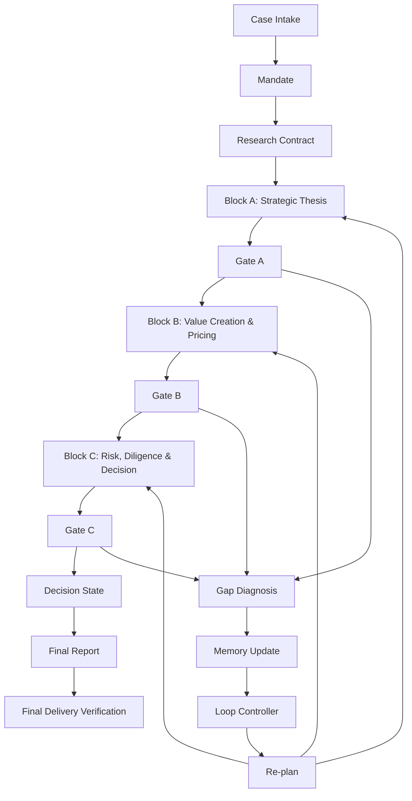

# Architecture

Block A executes Transaction Context, Buyer Strategic Need, Strategic Rationale, Target Attractiveness, Target Capability & Business Quality, Industry / Competitive Position and Strategic Fit. Block B executes Standalone Financial Analysis, Synergy Mechanism & Value Creation, Valuation & Purchase Price Discipline, Deal Structure & Financing Impact and Returns Analysis. Block C executes Due Diligence, Regulatory Risk, Integration Risk, Downside Risk and Decision State.

`full_pipeline.py` only orchestrates the completed runtimes. It creates validated, hashed A→B and A/B→C bundles; it does not replace their M&A criteria. Gate histories remain append-only. Reporting is a resumable delivery stage, so a report-copy or manifest failure does not rerun research.

Provider research proposes Source, Evidence, Claim and domain records. Deterministic admission, calculations, replay, PCE, ER/BRB and business Gates retain separate authority. Human reviewers retain legal, price, financing, risk-acceptance and final transaction authority.
