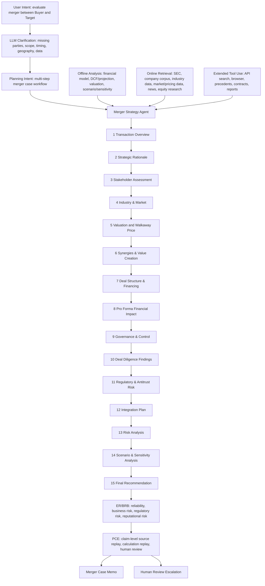

# Workflow Diagram — Merger Strategy Agent

The Mermaid source is stored in `workflow_diagram.mmd`.

```mermaid
flowchart TD
  A[User Intent: evaluate merger between Buyer and Target] --> B[LLM Clarification: missing parties, scope, timing, geography, data]
  B --> C[Planning Intent: multi-step merger case workflow]
  C --> D[Merger Strategy Agent]

  F[Offline Analysis: financial model, DCF/projection, valuation, scenario/sensitivity] --> D
  R[Online Retrieval: SEC, company corpus, industry data, market/pricing data, news, equity research] --> D
  T[Extended Tool Use: API search, browser, precedents, contracts, reports] --> D

  D --> S1[1 Transaction Overview]
  S1 --> S2[2 Strategic Rationale]
  S2 --> S3[3 Stakeholder Assessment]
  S3 --> S4[4 Industry & Market]
  S4 --> S5[5 Valuation and Walkaway Price]
  S5 --> S6[6 Synergies & Value Creation]
  S6 --> S7[7 Deal Structure & Financing]
  S7 --> S8[8 Pro Forma Financial Impact]
  S8 --> S9[9 Governance & Control]
  S9 --> S10[10 Deal Diligence Findings]
  S10 --> S11[11 Regulatory & Antitrust Risk]
  S11 --> S12[12 Integration Plan]
  S12 --> S13[13 Risk Analysis]
  S13 --> S14[14 Scenario & Sensitivity Analysis]
  S14 --> S15[15 Final Recommendation]

  S15 --> E[ER/BRB: reliability, business risk, regulatory risk, reputational risk]
  E --> P[PCE: claim-level source replay, calculation replay, human review]
  P --> O[Merger Case Memo]
  P --> H[Human Review Escalation]
```
